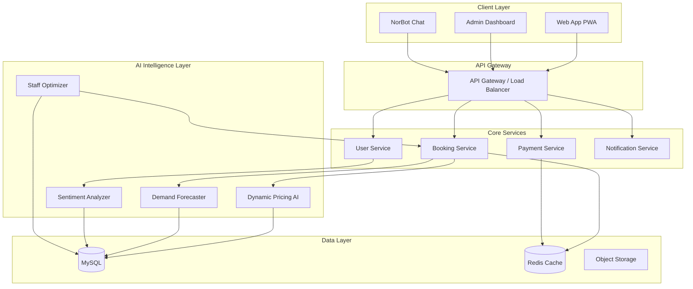
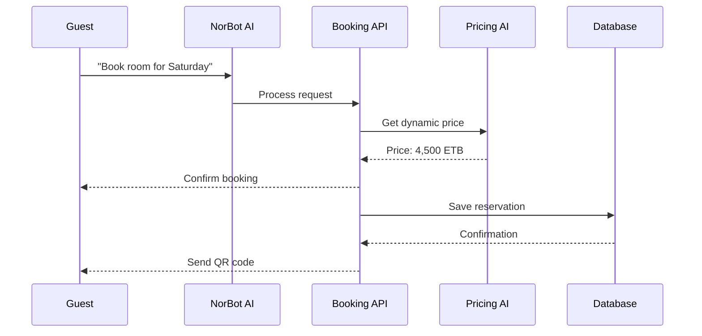

<p align="center">
  
</p>

<h1 align="center">
  ኖር (Nor) – AI Resort Concierge & Operations System
</h1>

<p align="center">
  <strong>Welcome to the future of Ethiopian hospitality.</strong><br>
  An AI-powered ecosystem that transforms how resorts operate, serve guests, and generate revenue.
</p>

<p align="center">
  <a href="https://norai.infinityfreeapp.com/htdoc/main/?i=1"><strong>🌐 Live Demo</strong></a> •
  <a href="#-features"><strong>✨ Features</strong></a> •
  <a href="#-quick-start"><strong>⚡ Quick Start</strong></a> •
  <a href="#-system-architecture"><strong>🏗️ Architecture</strong></a>
</p>

<p align="center">
  
  
  
  
  
</p>

<p align="center">
  <b>🏆 Official Submission – Hospitality Hackathon 2026</b><br>
  <i>Hosted by ALX Ethiopia • Kuriftu Resorts • weVenture Hub • Voice of Africa</i><br>
  <b>Team InnerCircle</b>
</p>

---

## 🎥 Demo Preview

<p align="center">
  
</p>

<p align="center">
  <i>Real-time AI predictions • NorBot concierge • Dynamic pricing dashboard</i>
</p>

---

## 🧠 About The Project

### The Problem

Ethiopia's hospitality sector is growing rapidly, but resorts face critical challenges:

| Challenge | Impact |
|-----------|--------|
| Fragmented operations | Wasted staff time, poor coordination |
| Manual pricing | 15-20% revenue leakage |
| Slow guest service | Low satisfaction, bad reviews |
| No data insights | Reactive instead of proactive decisions |

### The Solution

**Nor** is an AI-first hospitality management platform that:

- ⚡ **Predicts demand** – Dynamic pricing + occupancy forecasting
- 🤖 **Automates service** – 24/7 AI concierge (NorBot)
- 📊 **Optimizes operations** – Smart staffing + predictive maintenance
- 💰 **Increases revenue** – AI upselling + guest segmentation

---

## ✨ Features

### 🤖 AI-Powered Core

| Feature | Impact |
|---------|--------|
| **NorBot Concierge** | 24/7 guest requests in Amharic/English |
| **Dynamic Pricing Engine** | Real-time rate optimization → +15-25% RevPAR |
| **Predictive Staff Scheduling** | AI-optimized shift rosters → -30% overtime |
| **Maintenance Predictor** | Prevent failures before they happen |
| **Guest Sentiment AI** | Instant alert on negative feedback |
| **Revenue Forecaster** | 30-day predictions for better planning |

### 🧱 Full HMS Modules

```
📊 Dashboard          👥 Customer           🏢 Human Resources
💰 Accounts           🛒 Purchase           🍽️ Restaurant
📋 Reports            🚗 Transport          📅 Duty Roster
🛏️ Room Reservation   🏊 Pool Booking       🧹 Housekeeping
⚙️ Room Setting       📦 Units & Products   🔐 Role Permission
🌐 Language           ⚙️ Application Settings
```

### 🇪🇹 Ethiopia-Specific

- Telebirr, CBE Birr, cash payment integration
- Amharic language support (full UI)
- Ethiopian calendar & date format
- Local reporting standards (ETB)

---

## 📸 Screenshots

| Dashboard | AI Revenue Forecaster |
|-----------|----------------------|
|  |  |

| NorBot Concierge | Dynamic Pricing |
|------------------|-----------------|
|  |  |

| HRM Dashboard | Restaurant POS |
|---------------|----------------|
|  |  |

---

## 🏗️ System Architecture



### Data Flow



---

## 🛠 Tech Stack

| Layer | Technology | Version |
|-------|------------|---------|
| **AI/ML** | Python, Scikit-learn, XGBoost, Hugging Face | 3.10+ |
| **Backend** | PHP CodeIgniter 4 | 4.5+ |
| **Database** | MySQL + Redis | 8.0+ |
| **Frontend** | Next.js, Tailwind CSS | 14+ |
| **Mobile** | PWA (Workbox) | - |
| **Deployment** | Docker, Nginx | latest |
| **API** | REST + WebSocket | - |

### Why This Stack?

| Choice | Rationale |
|--------|-----------|
| PHP + CodeIgniter | Stable, fast, widely hosted in Ethiopia |
| Python AI services | Best-in-class ML ecosystem |
| Next.js | SEO-friendly guest portal |
| PWA | Works offline, installable on phones |
| Docker | Easy deployment anywhere |

---

## ⚡ Quick Start

### Prerequisites

```bash
# Required versions
PHP    >= 8.2
MySQL  >= 8.0
Python >= 3.10
Node   >= 18
```

### Installation (5 minutes)

```bash
# 1. Clone the repository
git clone https://github.com/Hope0351/ALX_Hospitality_hackathon-.git
cd ALX_Hospitality_hackathon-

# 2. Start with Docker (recommended)
docker-compose up -d

# 3. Run installer
# Open browser → http://localhost:8080/install

# 4. Start AI services (separate terminal)
cd ai-services
pip install -r requirements.txt
python app.py
```

### Manual Installation

```bash
# Backend setup
composer install
cp .env.example .env
php spark migrate
php spark db:seed

# Frontend setup
cd frontend
npm install
npm run build

# Start server
php spark serve
```

### Environment Variables

Create `.env` file:

```env
# Database
DB_HOST=localhost
DB_NAME=nor_db
DB_USER=root
DB_PASS=password

# AI Services
AI_API_URL=http://localhost:5001
AI_API_KEY=your_key

# Payments (Ethiopian)
TELEBIRR_API_KEY=your_key
CBE_API_KEY=your_key
```

---

## 🚀 Usage Guide

### For Resort Managers

```bash
Login: admin@nor.com / password123
```

1. **Dashboard** → View AI insights & forecasts
2. **Dynamic Pricing** → Monitor automated rate changes
3. **Staff Scheduling** → Review AI-optimized rosters
4. **Reports** → Generate ETB financial reports

### For Guests

```bash
Access: http://yourdomain.com
```

1. **Browse** rooms & services
2. **Chat with NorBot** for recommendations
3. **Book instantly** with Telebirr/CBE
4. **Manage** reservations via guest portal
5. **Scan QR code** in-room for service requests

### For NorBot AI Concierge

Try these commands:

```
"Book a room for 2 people this weekend"
"I need extra towels in room 204"
"What's the best traditional food here?"
"Schedule a spa treatment for tomorrow at 3 PM"
```

---

## 📊 Impact Metrics

| KPI | Baseline | With Nor | Improvement |
|-----|----------|----------|-------------|
| RevPAR (Revenue per available room) | 1,200 ETB | 1,500 ETB | **+25%** |
| Staff scheduling time | 4 hrs/week | 30 min/week | **-87%** |
| Guest response time | 15 minutes | 30 seconds | **-97%** |
| Operational waste | 20% of budget | 14% | **-30%** |
| Guest satisfaction | 4.0/5 | 4.6/5 | **+15%** |

---

## 🛣️ Roadmap

### ✅ Completed (MVP)
- [x] Core HMS modules (25+ modules)
- [x] Multi-language (Amharic/English)
- [x] Ethiopian payment integration
- [x] AI dynamic pricing engine
- [x] NorBot basic concierge

### 🚧 In Progress
- [ ] Voice-enabled NorBot
- [ ] IoT room automation integration
- [ ] Advanced revenue forecasting

### 📅 Planned
- [ ] Mobile native apps (iOS/Android)
- [ ] Multi-property support (resort chains)
- [ ] Integration with international OTAs
- [ ] Blockchain for guest loyalty points

---

## 🧪 Testing

```bash
# Backend tests
php spark test

# Frontend tests
cd frontend && npm test

# AI service tests
cd ai-services && pytest

# E2E tests
npm run test:e2e
```

---

## 🤝 Contributing

We welcome contributions! See our [Contributing Guide](CONTRIBUTING.md).

```bash
1. Fork the repo
2. Create feature branch (git checkout -b feature/amazing)
3. Commit changes (git commit -m 'Add amazing feature')
4. Push (git push origin feature/amazing)
5. Open Pull Request
```

---

## 👥 Team InnerCircle

| Role | Name | Focus |
|------|------|-------|
| **AI/ML Lead** | [Name] | Predictive models, NLP, NorBot |
| **Backend Architect** | [Name] | PHP Core, API, Database |
| **Frontend Developer** | [Name] | Next.js, PWA, UI/UX |
| **Hospitality Strategist** | [Name] | Workflows, Local insights |

---

## 🙏 Acknowledgments

- **Hospitality Hackathon ET** – For this incredible challenge
- **ALX Ethiopia** – Training and venue support
- **Kuriftu Resorts** – Industry insights and venue
- **weVenture Hub** – Incubation opportunities
- **Voice of Africa** – Media partnership
- **Otto Kurzendorfer** (Hyatt Regency) – Fireside chat insights
- **Mahlet Tadiwos Salu** (Kuriftu) – Commercial strategy guidance

---

## 📄 License

```
MIT License

Copyright (c) 2026 Team InnerCircle

Permission is hereby granted, free of charge, to any person obtaining a copy
of this software and associated documentation files...
```

---

## 📞 Contact & Links

| Platform | Link |
|----------|------|
| **Live Demo** | [https://nor-demo.yourdomain.com](https://nor-demo.yourdomain.com) |
| **GitHub** | [https://github.com/Hope0351/ALX_Hospitality_hackathon-](https://github.com/Hope0351/ALX_Hospitality_hackathon-) |
| **Video Pitch** | [YouTube Link](https://youtube.com) |
| **Email** | team@innercircle.et |
| **LinkedIn** | [Team InnerCircle](https://linkedin.com/company/innercircle) |

---

<p align="center">
  <b>Made with ☕ and AI for Ethiopian hospitality</b><br>
  <i>"Nor" – እንኳን ደህና መጣህ (Welcome)</i>
</p>

<p align="center">
  
</p>
```
